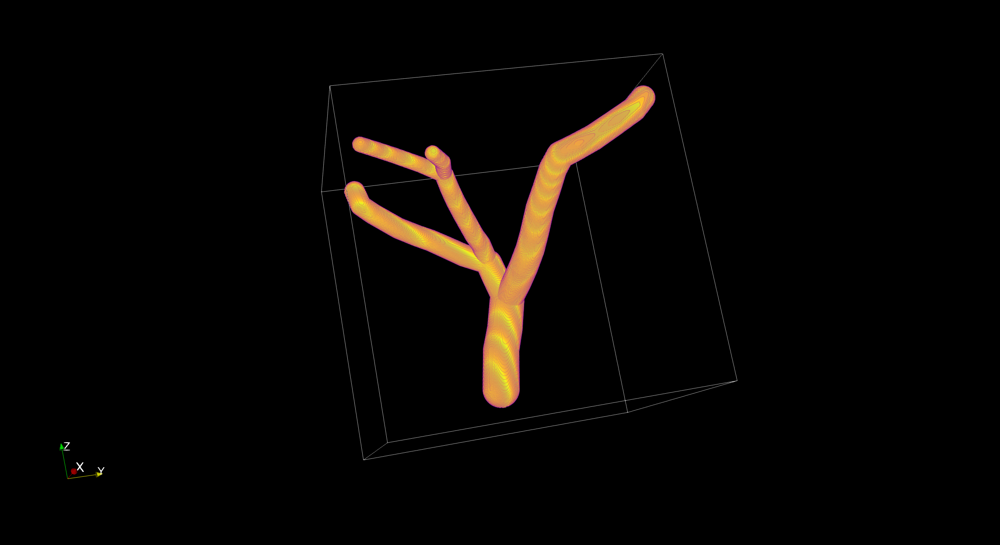
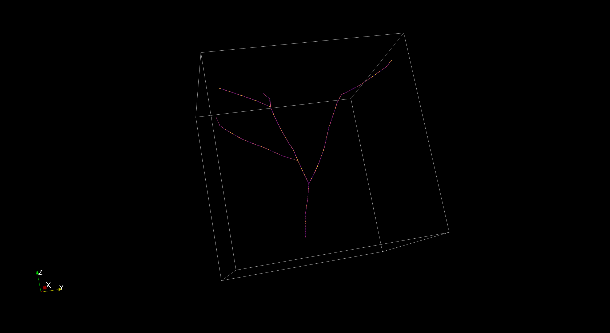
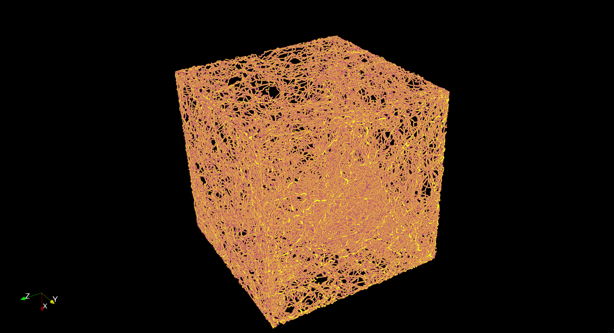
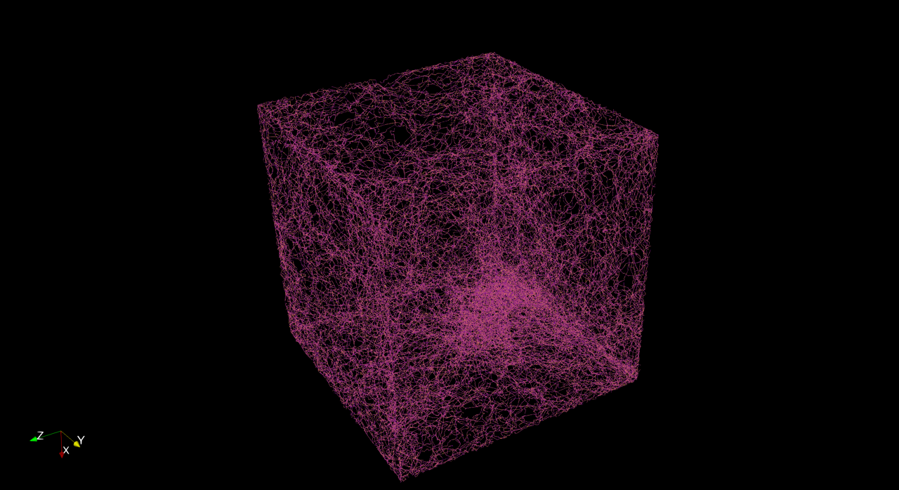
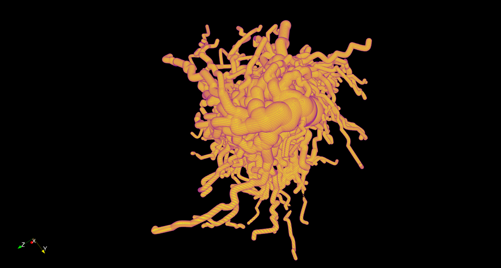
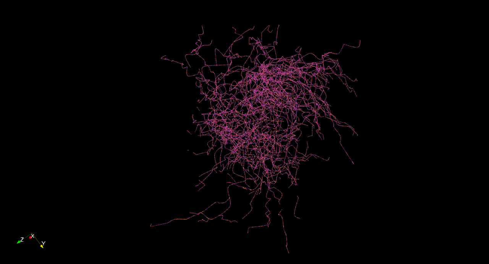

# V-System Vascular Network Dataset Generator

Synthetic **vascular volumes + centreline skeletons + graph metadata** for training and benchmarking **skeletonization / centreline** models. Inspired by [psweens/V-System](https://github.com/psweens/V-System), with a focus on large-volume generation, explicit topology control, and paired outputs suitable for ML.

---

## Outputs

- **Volumes** (vessels + centreline) in one or more of:
  - **Zarr** (`volume.zarr/{vessels,centreline}`)
  - **NIfTI** (`vessels.nii.gz`, `centreline.nii.gz`)
  - **TIFF slices** (`tiff/{vessels,centreline}/z00000.tif`, …)
- **Graph CSVs**: `nodes.csv`, `edges.csv`, `edge_samples.csv`, `branches.csv`, `branch_endpoints.csv`, `adjacency.csv`
- **Metadata-rich folder names** (embedding shape/format/pixdim/curved/complexity/seed)

```
sample_0003__shape-1024x1024x1024__fmt-nifti__pix-1x1x1__curved-1__comp-na__seed-42/
├── vessels.nii.gz
├── centreline.nii.gz
├── tiff/...
├── volume.zarr/...
└── *.csv
```

---

## Installation (Python ≥3.9 recommended)

```bash
python -m venv venv && source venv/bin/activate 
pip install -r requirements.txt
```

---

## Example Binary Volumes and Paired Centre-line Skeletons

<p align="center">
  
</p>

<p align="center">
  
</p>

*Figure: Example output of small binary volume and paired centre-line skeleton in sparse vascular parametrisation.*

<p align="center">
  
</p>

<p align="center">
  
</p>

*Figure: Example output of binary volume and paired centre-line skeleton in dense/thin unrestricted vascular parametrisation.*

<p align="center">
  
</p>

<p align="center">
  
</p>

*Figure: Example output of binary volume and paired centre-line skeleton in sparse/mixed unrestricted vascular parametrisation.*


---

## Quickstart

Generate 2 samples (1024³) as **TIFF** + **NIfTI**, plus **binned NIfTI** at /2 and /4:

```bash
python v_system_skeletonization_dataset_generator.py   --out ./datasets   --num 2   --format tiff_slices --also-nifti --binned-export 1 2   --shape 1024 1024 1024 --chunks 192 192 192   --root-inward --first-seg-len 160   --initial-diam 110 --min-diam 8 --max-diam 120 --min-diam-stop 8   --branch-prob 0.09 --taper 0.95   --self-avoid   --clearance-mode sum --clearance-factor 1.05 --clearance-cap 8 --surface-clearance 1.2   --skip-t-head 0.25 --max-dir-tries 64 --samples-per-seg 12   --max-segments 1000 --boundary 12   --max-wall-avoid-bend 50 --wall-clearance 1.2   --seed 42 --workers 8
```

---

## How volumes & centrelines are created

- The generator **grows a graph first** (nodes/edges with per-edge polylines and radii).
- **Binary vessel volume** is rasterized by painting truncated cones along each polyline segment.
- **Centreline** is **not** a thinning result; it is rasterized **directly** from the edge polylines (one-voxel-wide).
- **Binned exports (`--binned-export`)** downsample both masks with **3D max-pooling** (logical **OR**) to preserve connectivity/topology. Voxel spacings in the NIfTI header are scaled accordingly.

---

## Key features

- **Curved branches** (Catmull–Rom / Bézier), **taper**, **Murray’s law** splits
- **Self-avoidance** with spatial hashing + configurable clearance models (`sum|min|geom` + optional cap)
- **Wall avoidance**: reject segments that would contact the boundary; stop tips if avoiding the wall would require a sharp (> `--max-wall-avoid-bend`) turn
- **Inward “warm-up”** roots (`--root-inward`, `--first-seg-len`)
- **Chunked painting** for huge volumes (Zarr) and **multi-process** sample generation
- Robust cleanup of temporary files when writing NIfTI/TIFF

---

## Most useful CLI flags (curated)

### Growth & geometry
- `--min-seg / --max-seg` — logical segment length range (voxels)
- `--taper` — per-segment taper `<1` (e.g. 0.95)
- `--branch-prob` — per-tip branch probability
- `--force-branch-depth` — force branching for very early generations
- `--no-branch-before-depth`, `--early-branch-depth`, `--early-branch-prob` — delay/dampen early branching
- `--samples-per-seg` — polyline sampling density per segment
- `--curved` + `--curve-mode {catmull,bezier}` — curvature model

### Self-avoidance & spacing
- `--self-avoid` — enable collision checks
- `--clearance-mode {sum|min|geom}` — how to combine radii into a “personal space”
- `--clearance-factor` — multiplies the clearance term
- `--clearance-cap` — hard cap (voxels) on clearance before adding `--surface-clearance`
- `--surface-clearance` — extra surface gap (voxels)
- `--skip-t-head` — ignore the last *t* fraction of a segment during checks (helps tips branch near parents)
- `--max-dir-tries` — retries when a direction collides

### Wall avoidance
- `--boundary` — inner margin clamp for all coordinates
- `--wall-clearance` — minimum gap between vessel surface and volume walls
- `--max-wall-avoid-bend` — if escaping a wall needs > this angle, stop the tip

### Output & parallelism
- `--format {zarr,nifti,tiff_slices}` (+ `--also-nifti`, `--also-tiff-slices`)
- `--binned-export K...` — write additional **NIfTI** at `2^K` downsampling (e.g., `1 2` → 512³ & 256³)
- `--chunks` — painting chunk size (X Y Z)
- `--workers` — parallel samples (1 process per sample)
- `--seed` — reproducibility (per-sample seeds are derived)

---

## Parameter recipes (copy/paste)

> These are starting points; tune to taste. All assume `--shape 1024 1024 1024` and `--chunks 192 192 192` unless specified.

### 1) Balanced (moderate density, avoids reconnections)
```bash
--branch-prob 0.08 --taper 0.95 --self-avoid --clearance-mode sum --clearance-factor 1.05 --clearance-cap 8 --surface-clearance 1.2 --skip-t-head 0.25 --max-dir-tries 64 --samples-per-seg 12 --no-branch-before-depth 2 --early-branch-depth 8 --early-branch-prob 0.02 --boundary 12 --wall-clearance 1.2 --max-wall-avoid-bend 50
```

### 2) Dense & thin vasculature (more branches, smaller diameters)
```bash
--min-diam 6 --max-diam 80 --min-diam-stop 6 --branch-prob 0.12 --taper 0.93 --clearance-mode sum --clearance-factor 1.0 --clearance-cap 6 --surface-clearance 1.0 --samples-per-seg 10 --max-dir-tries 80 --no-branch-before-depth 1 --early-branch-depth 6 --early-branch-prob 0.03 --boundary 10 --wall-clearance 1.0
```

### 3) Sparse & thick vasculature (fewer branches, larger diameters)
```bash
--min-diam 40 --max-diam 140 --min-diam-stop 35 --branch-prob 0.05 --taper 0.98 --clearance-mode min --clearance-factor 1.0 --clearance-cap 8 --surface-clearance 0.8 --samples-per-seg 8 --max-dir-tries 48 --no-branch-before-depth 2 --early-branch-depth 6 --early-branch-prob 0.01 --boundary 20 --wall-clearance 1.0
```

### 4) Large-vessel emphasis with gentle branching
```bash
--initial-diam 110 --min-diam 55 --max-diam 120 --min-diam-stop 40 --branch-prob 0.06 --force-branch-depth 2 --taper 0.99 --clearance-mode min --clearance-factor 1.0 --clearance-cap 8 --surface-clearance 0.8 --root-inward --first-seg-len 220 --max-dir-tries 64 --samples-per-seg 8 --boundary 24 --wall-clearance 1.0
```

### 5) Strong anti‑reconnection (give more space between branches)
```bash
--self-avoid --clearance-mode sum --clearance-factor 1.1 --clearance-cap 10 --surface-clearance 1.5 --skip-t-head 0.30 --sh-cell 4 --max-dir-tries 96 --branch-prob 0.08 --taper 0.95 --boundary 14 --wall-clearance 1.4
```

### 6) Capillary‑like (high branching, thin radii, lots of segments)
```bash
--min-diam 4 --max-diam 35 --min-diam-stop 4 --branch-prob 0.16 --taper 0.94 --min-seg 10 --max-seg 28 --max-segments 2000 --clearance-mode geom --clearance-factor 1.0 --surface-clearance 1.0 --skip-t-head 0.2 --samples-per-seg 12 --max-dir-tries 80 --boundary 8 --wall-clearance 0.8
```

### 7) Long trunk with sparse side branches
```bash
--root-inward --first-seg-len 200 --branch-prob 0.04 --force-branch-depth 1 --no-branch-before-depth 3 --early-branch-depth 6 --early-branch-prob 0.01 --taper 0.985 --min-seg 24 --max-seg 60 --max-dir-tries 64 --clearance-mode sum --clearance-factor 1.05 --surface-clearance 1.2
```

### 8) Near‑wall avoidance emphasized
```bash
--boundary 20 --wall-clearance 1.6 --max-wall-avoid-bend 45 --max-dir-tries 96 --skip-t-head 0.3 --clearance-mode sum --clearance-factor 1.05 --surface-clearance 1.2
```

### 9) Fast dev test (small volume)
```bash
--shape 256 256 256 --chunks 96 96 96 --num 2 --format nifti --min-diam 8 --max-diam 80 --branch-prob 0.10 --taper 0.95 --self-avoid --clearance-mode sum --clearance-factor 1.0 --surface-clearance 1.0 --max-segments 300 --seed 123
```

---

## Tips

**To avoid only one trunk without branching**  
- Increase `--branch-prob` a bit; reduce early gating (`--no-branch-before-depth`, `--early-branch-depth`).
- Lower `--min-diam-stop` so tips can continue growing.
- Increase `--max-dir-tries`; slightly reduce strictness (`--clearance-factor`, `--surface-clearance`).
- Check `--boundary`: too large confines growth.

**If branches appear to reconnect later**  
- Use `--clearance-mode sum` with a slightly larger `--clearance-factor` and `--surface-clearance`.
- Add/raise `--clearance-cap` to prevent huge parents from over‑dominating.
- Increase `--skip-t-head` (e.g., 0.25–0.35) to allow tips to branch near parents without immediately colliding.

**Tips stall near the box wall**  
- Increase `--boundary` and/or `--wall-clearance`.
- Lower `--max-wall-avoid-bend` if you prefer stopping over sharp detours; raise it to allow more curvature.

**Binned NIfTI doesn’t match topology**  
- Ensure factors are powers of 2: `--binned-export 1 2 3` → /2, /4, /8.
- Downsampling is 3D **max‑pool** (logical OR) applied to both vessels and centrelines to preserve connectivity.

---
